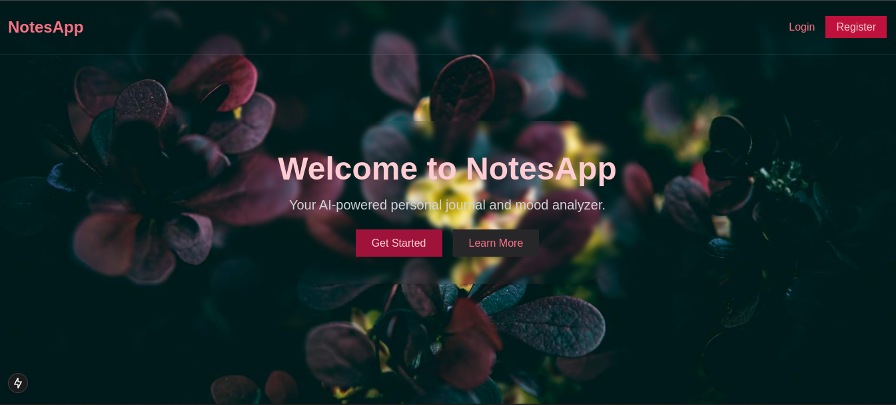
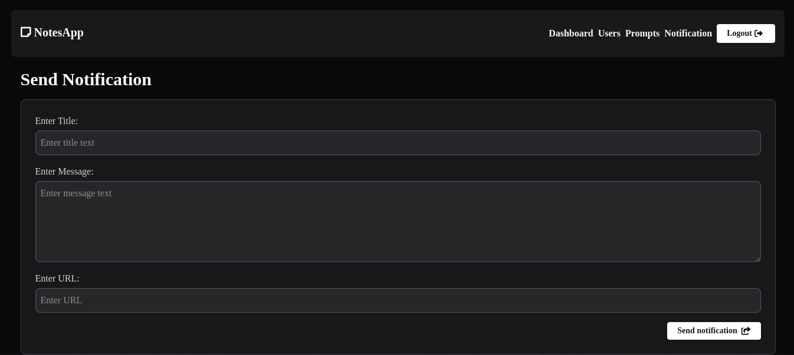

# AI Journal APP  

 

AI Journal APP is a smart journaling platform powered by AI, designed to help users reflect on their thoughts, analyze emotions, and gain insights from their journal entries.  

## ✨ Features  

✅ **AI-powered analysis** using Hugging Face LLMs  
✅ **Zero-shot classification** for automatic categorization  
✅ **Sentiment analysis** to understand emotions in journal entries  
✅ **User-friendly frontend** built with Next.js  
✅ **Secure backend APIs** developed with PHP (Laravel/Core PHP)  
✅ **Admin dashboard** powered by Python for managing and reviewing journal data  

## 🏗️ Tech Stack  

| Component  | Technology |
|------------|------------|
| **Frontend**  | Next.js (React, TypeScript) |
| **Backend APIs**  | PHP (Core PHP) |
| **AI & Analysis** | Python (Hugging Face Transformers) |
| **Admin Dashboard** | Python (Flask) |

## 🚀 Installation & Setup  

### Backend (PHP APIs)  
1. Clone the repository on your localserver (htdocs, html directories):  
   ```sh
   git clone https://github.com/yourusername/ai-journal-app.git
   cd ai-journal-app/backend
   ```
2. Install dependencies:  
   ```sh
   composer install
   ```
3. Create database and import `notesapp.sql` file into your MySQL database

### Frontend (Next.js)  
1. Navigate to the frontend folder:  
   ```sh
   cd ../frontend
   ```
2. Install dependencies:  
   ```sh
   npm install
   ```
3. Start the development server:  
   ```sh
   npm run dev
   ```

### AI Processing (Python)  
1. Navigate to the AI processing folder:  
   ```sh
   cd ..backend/ai
   ```
2. Install dependencies:  
   ```sh
   pip install -r requirements.txt
   ```
3. Run the AI processing script:  
   ```sh
   python app.py
   ```

## 📸 Screenshots  


 

## 📜 License  

This project is licensed under the [MIT License](LICENSE).  

## 🤝 Contributing  

Contributions are welcome! If you want to improve this app, feel free to open an issue or submit a pull request.  

---

Let me know if you need any additional sections! 🚀